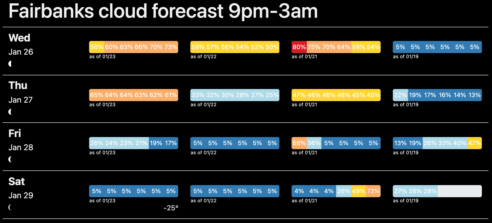

# Fairbanks cloud forecast

Fairbanks, Alaska is a good place to see the aurora borealis, if the skies are clear. Get and display
cloud cover forecasts for 9pm-3am for the next 10 days, and see how they change over time.

## description

Get and save hourly cloud cover forecasts for 9pm, group by night (instead of date), and write HTML to
display current forecast and previous forecasts for the next 10 days.

Get a weather forecast from [Visual Crossing](https://www.visualcrossing.com/). Re-format to group hourly forecasts from 9pm - 3am (over two dates from the API) into one night.

Get JSON dataset from S3, merge with new forecasts, and re-upload.

Render data as HTML with a Jinja2 template. Show history of cloud cover forecasts for the next 10 days, along
with moon phase and temperature forecasts. Write past forecasts to a history file. Display moon phase with [weather icons font](https://erikflowers.github.io/weather-icons/).

Run daily as an AWS Lambda function.

## deploy

`build.sh`:

  - build a Docker container
  - push to ECR
  - update Lambda function container

Lambda environment variables:

  - `VC_KEY` - API key for Visual Crossing forecasts
  - `S3_BUCKET` - S3 bucket for forecast data and HTML
  - `PREFIX` - path prefix for files in S3 bucket

## sample

